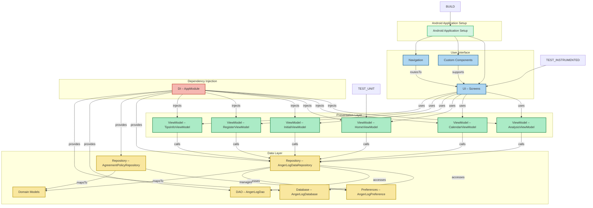

```mermaid
flowchart TD
    subgraph "Android Application Setup"
        APP_SETUP["Android Application Setup"]:::setup
    end

    subgraph "User Interface"
        UI_Screens["UI – Screens"]:::ui
        UI_Components["Custom Components"]:::ui
        UI_Navigation["Navigation"]:::ui
    end

    subgraph "Presentation Layer"
        VM_Analysis["ViewModel – AnalysisViewModel"]:::presentation
        VM_Calendar["ViewModel – CalendarViewModel"]:::presentation
        VM_Home["ViewModel – HomeViewModel"]:::presentation
        VM_Initial["ViewModel – InitialViewModel"]:::presentation
        VM_Register["ViewModel – RegisterViewModel"]:::presentation
        VM_Tips["ViewModel – TipsInfoViewModel"]:::presentation
    end

    subgraph "Data Layer"
        REPO_AngerLog["Repository – AngerLogDataRepository"]:::data
        REPO_Agreement["Repository – AgreementPolicyRepository"]:::data
        DB["Database – AngerLogDatabase"]:::data
        DAO["DAO – AngerLogDao"]:::data
        PREF["Preferences – AngerLogPreference"]:::data
        DOMAIN["Domain Models"]:::data
    end

    subgraph "Dependency Injection"
        DI["DI – AppModule"]:::di
    end

    %% Connections
    APP_SETUP --> UI_Screens
    APP_SETUP --> UI_Components
    APP_SETUP --> UI_Navigation

    UI_Screens -->|"uses"| VM_Analysis
    UI_Screens -->|"uses"| VM_Calendar
    UI_Screens -->|"uses"| VM_Home
    UI_Screens -->|"uses"| VM_Initial
    UI_Screens -->|"uses"| VM_Register
    UI_Screens -->|"uses"| VM_Tips

    UI_Components -->|"supports"| UI_Screens
    UI_Navigation -->|"routesTo"| UI_Screens

    VM_Analysis -->|"calls"| REPO_AngerLog
    VM_Calendar -->|"calls"| REPO_AngerLog
    VM_Home -->|"calls"| REPO_AngerLog
    VM_Initial -->|"calls"| REPO_AngerLog
    VM_Register -->|"calls"| REPO_AngerLog
    VM_Tips -->|"calls"| REPO_AngerLog

    REPO_AngerLog -->|"accesses"| DB
    REPO_AngerLog -->|"accesses"| DAO
    REPO_AngerLog -->|"accesses"| PREF
    REPO_Agreement -->|"manages"| PREF

    DI -->|"injects"| VM_Analysis
    DI -->|"injects"| VM_Calendar
    DI -->|"injects"| VM_Home
    DI -->|"injects"| VM_Initial
    DI -->|"injects"| VM_Register
    DI -->|"injects"| VM_Tips
    DI -->|"provides"| REPO_AngerLog
    DI -->|"provides"| REPO_Agreement
    DI -->|"provides"| DAO
    DI -->|"provides"| DB

    REPO_AngerLog -->|"mapsTo"| DOMAIN
    REPO_Agreement -->|"mapsTo"| DOMAIN

    BUILD --> APP_SETUP
    TEST_UNIT --> VM_Home
    TEST_INSTRUMENTED --> UI_Screens

    %% Class Definitions
    classDef ui fill:#AED6F1,stroke:#1F618D,stroke-width:2px;
    classDef presentation fill:#ABEBC6,stroke:#1D8348,stroke-width:2px;
    classDef data fill:#F9E79F,stroke:#B7950B,stroke-width:2px;
    classDef di fill:#F5B7B1,stroke:#C0392B,stroke-width:2px;
    classDef testing fill:#FADBD8,stroke:#922B21,stroke-width:2px;
    classDef external fill:#D7BDE2,stroke:#6C3483,stroke-width:2px;
    classDef setup fill:#D5F5E3,stroke:#27AE60,stroke-width:2px;

    %% Click Events
    click APP_SETUP "https://github.com/kurramkurram/angerlog/tree/master/app/src/main/java/io/github/kurramkurram/angerlog"
    click UI_Screens "https://github.com/kurramkurram/angerlog/tree/master/app/src/main/java/io/github/kurramkurram/angerlog/ui/screen"
    click UI_Components "https://github.com/kurramkurram/angerlog/tree/master/app/src/main/java/io/github/kurramkurram/angerlog/ui/component"
    click UI_Navigation "https://github.com/kurramkurram/angerlog/blob/master/app/src/main/java/io/github/kurramkurram/angerlog/ui/navigation/AngerLogNavigation.kt"
    click VM_Analysis "https://github.com/kurramkurram/angerlog/blob/master/app/src/main/java/io/github/kurramkurram/angerlog/ui/screen/analysis/AnalysisViewModel.kt"
    click VM_Calendar "https://github.com/kurramkurram/angerlog/blob/master/app/src/main/java/io/github/kurramkurram/angerlog/ui/screen/calendar/CalendarViewModel.kt"
    click VM_Home "https://github.com/kurramkurram/angerlog/blob/master/app/src/main/java/io/github/kurramkurram/angerlog/ui/screen/home/HomeViewModel.kt"
    click VM_Initial "https://github.com/kurramkurram/angerlog/blob/master/app/src/main/java/io/github/kurramkurram/angerlog/ui/screen/initial/InitialViewModel.kt"
    click VM_Register "https://github.com/kurramkurram/angerlog/blob/master/app/src/main/java/io/github/kurramkurram/angerlog/ui/screen/register/RegisterViewModel.kt"
    click VM_Tips "https://github.com/kurramkurram/angerlog/blob/master/app/src/main/java/io/github/kurramkurram/angerlog/ui/screen/tips/TipsInfoViewModel.kt"
    click REPO_AngerLog "https://github.com/kurramkurram/angerlog/blob/master/app/src/main/java/io/github/kurramkurram/angerlog/data/repository/AngerLogDataRepository.kt"
    click REPO_Agreement "https://github.com/kurramkurram/angerlog/blob/master/app/src/main/java/io/github/kurramkurram/angerlog/data/repository/AgreementPolicyRepository.kt"
    click DB "https://github.com/kurramkurram/angerlog/blob/master/app/src/main/java/io/github/kurramkurram/angerlog/data/database/AngerLogDatabase.kt"
    click DAO "https://github.com/kurramkurram/angerlog/blob/master/app/src/main/java/io/github/kurramkurram/angerlog/data/dao/AngerLogDao.kt"
    click PREF "https://github.com/kurramkurram/angerlog/blob/master/app/src/main/java/io/github/kurramkurram/angerlog/data/preference/AngerLogPreference.kt"
    click DOMAIN "https://github.com/kurramkurram/angerlog/tree/master/app/src/main/java/io/github/kurramkurram/angerlog/model"
    click DI "https://github.com/kurramkurram/angerlog/blob/master/app/src/main/java/io/github/kurramkurram/angerlog/di/AppModule.kt"
    click TEST_UNIT "https://github.com/kurramkurram/angerlog/tree/master/app/src/test/java/io/github/kurramkurram/angerlog"
    click TEST_INSTRUMENTED "https://github.com/kurramkurram/angerlog/tree/master/app/src/androidTest/java/io/github/kurramkurram/angerlog"
    click BUILD "https://github.com/kurramkurram/angerlog/tree/master/.github/workflows"
    click XD "https://github.com/kurramkurram/angerlog/blob/master/xd/アンガーログ.xd"
```

※https://gitdiagram.com/kurramkurram/AngerLog/ により作成